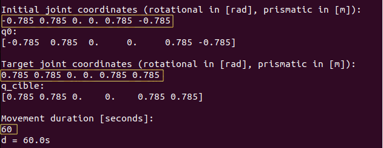
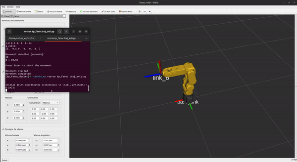

**This README provides an overview of the ros-technical-test repository, including required tasks, usage instructions, and code details.**

**Required Tasks:**

* **Direct geometric model (mgd.py):** Implement the missing methods `compute_Ti(self, dh, q)`, `compute_T(self, Q, i, j)`, and `compute_robot_state(self, Q)`. These methods are used for calculating homogeneous transformation matrices based on Denavit-Hartenberg parameters and joint angles.
* **Trajectory node (traj_arti.py):** Develop the `traj_arti` node responsible for:
    * Interpolating joint trajectories between two provided positions.
    * Publishing joint commands on the `/joints_state` topic for robot control.
* **Merge request creation:** Submit a merge request containing both the implemented code and markdown documentation explaining its usage.

**Using the Docker Container:**

**Prerequisites:**

* **Docker:** Ensure you have Docker installed. 
    * **Ubuntu:**
        * Follow the installation guide: [https://docs.docker.com/engine/install/ubuntu/](https://docs.docker.com/engine/install/ubuntu/)
        * Configure post-installation: [ https://docs.docker.com/engine/install/linux-postinstall/](https://docs.docker.com/engine/install/linux-postinstall/)
    * **Windows:**
        * Install WSL2.
        * Install Docker Desktop: [https://docs.docker.com/desktop/install/windows-install/](https://docs.docker.com/desktop/install/windows-install/)

**Steps:**

1. **Clone the repository:**

   ```bash
   git clone https://github.com/muttequrashi/ros-technical-test.git
   ```

2. **Build the container:**

   ```bash
   cd ros-technical-test/docker
   docker build --tag tp_fanuc_docker .
   ```

3. **Launch the container:**

   ```bash
   ./start_docker.zsh  # Ubuntu
   sh start_docker_wsl.sh # WSL
   ```

4. **Access the container (optional):**

   ```bash
   docker exec -it tp_fanuc zsh
   ```

5. **Compile and source the workspace (inside the container):**

   ```bash
   catkin_make    # compile
   chmod +x src/robotique_experimentale/tp_fanuc/scripts/* # make scripts executable
   source devel/setup.zsh
   ```

6. **Run the launch file:**

   ```bash
   roslaunch tp_fanuc tp_DHm.launch
   ```

7. **Run the trajectory script:**

   In another terminal, access the container and execute the following:

   ```bash
   docker exec -it tp_fanuc zsh
   source devel/setup.zsh
   rosrun tp_fanuc traj_arti.py
   ```

   The script will prompt you for initial and target joint positions (6 values in radians), and duration (seconds).

**Example Input:**

```
Initial: -0.785 0.785 0. 0. 0.785 -0.785
Target: 0.785 0.785 0. 0. 0.785 0.785
Duration: 60
```
Example input is highlighted in the picture below:



**Results of Sample Trajectory:**


